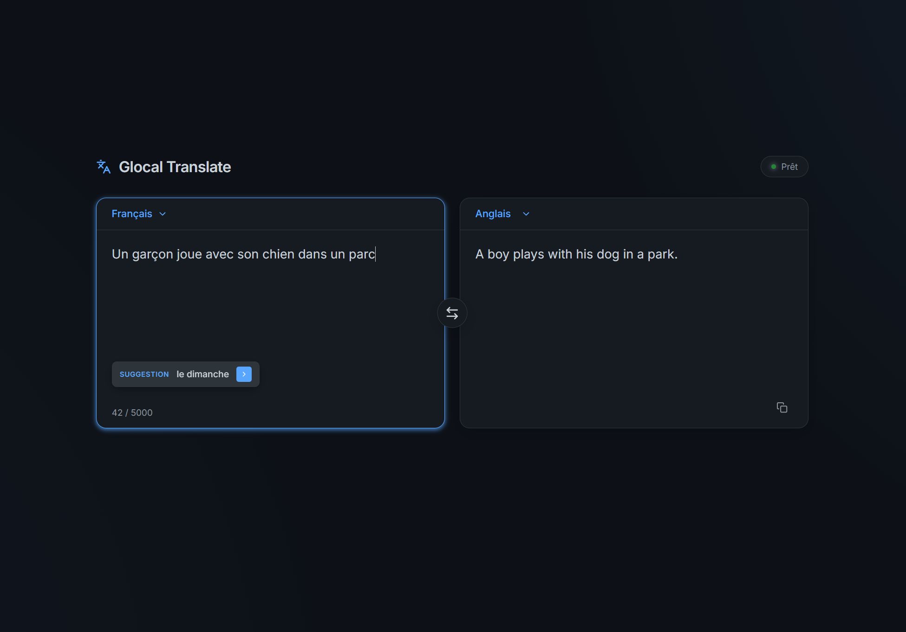

<div align="center">

# 🌐 Glocal Translate & Prompt Enhancer

<p align="center">
  <b>Traduction locale ultra-fidèle (FR ↔ EN), 100% Non-Censurée (NSFW), Correction Automatique et Optimiseur de Prompts IA SOTA alimenté par Qwen2.5-3B Uncensored sur CPU.</b>
</p>

[](https://www.python.org/)
[](https://fastapi.tiangolo.com/)
[](https://huggingface.co/mradermacher/Qwen2.5-3B-Instruct-Uncensored-GGUF)
[](#-performances--cpu)
[](README.md)
[](LICENSE)

<br/>



</div>

---

## 📖 À propos

**Glocal Translate** est une application web de traduction et d'optimisation de prompts **100% privée, autonome et hors-ligne**. Elle fonctionne entièrement sur votre processeur (CPU) sans nécessiter de carte graphique dédiée (GPU), de clé API ni de serveur distant.

Conçu autour du modèle **Qwen2.5-3B-Instruct-Uncensored** (format GGUF Q4_K_M débridé/abliterated), cet outil élimine toutes les restrictions de modération usuelles pour offrir une fidélité de traduction absolue, y compris pour le langage familier, l'argot, les gros mots et les contenus explicites/NSFW.

---

## ✨ Fonctionnalités Clés

* 🔒 **100% Privé, Hors-Ligne & Stateless** : Vos textes ne quittent jamais votre machine. Le modèle LLM local ne conserve aucun historique de vos conversations en mémoire.
* 🔓 **100% Non-Censuré (NSFW / Argot / Insultes)** : Grâce au modèle débridé (*abliterated*), tout le vocabulaire est traduit avec une fidélité brute sans refus ni moralisation.
* ⚡ **Optimisé CPU, Déchargement RAM (60s) & Arrêt Automatique** :
  * **Faible empreinte RAM** (~2.0 Go) et vitesse d'exécution élevée (~40 tokens/sec).
  * **Auto-Unload RAM (60s)** : Libère la mémoire RAM si aucun usage n'est détecté pendant 1 minute.
  * **Auto-Shutdown du serveur Python** : Coupe immédiatement le serveur et la console Windows dès la fermeture de la page web ou de l'onglet.
* 💡 **Correction Orthographique & Grammaticale Intelligente** : Détecte les fautes de frappe, coquilles et accents manquants à la volée (*ex: "salt ca va ?" ➔ "salut ça va ?"*) et propose une correction en 1 clic.
* ✨ **Mode Prompt Enhancer par Modèle IA (SOTA & Open-Source)** :
  * 🔥 **FLUX.1 / FLUX.2** (Prose naturelle & organisation spatiale)
  * 🌸 **Anima 2B** (Illustration Anime, Manga & 2.5D avec Danbooru tags & negative prompts)
  * 🔮 **Boogu-Image 10B** (Design, layouts complexes & texte bilingue)
  * ⚡ **Krea 2** (Hyper-réalisme studio, textures de peau & art numérique)
  * 🔤 **Ideogram 2.0 / 4.0** (Design graphique, typographie & textes "EXACTS")
  * 🌟 **Stable Diffusion 3.5 Large** (Encodeur T5 & détails d'optique)
  * 🛠️ **SDXL** (Keywords structurés + Negative Prompt automatique)
  * 🎬 **Midjourney v6 / v7** (Style cinématique + paramètres `--ar --style`)
  * 📹 **AI Video (Wan 2.1 / Hunyuan / Luma)** (Mouvements & trajectoire de caméra)
* 📜 **Historique Local Optionnel & 100% Privé** :
  * Bouton discret `Historique Local` dans le footer pour consulter et rappeler vos anciens éléments en 1 clic.
  * Bouton `🗑️ Supprimer définitivement` et case à cocher **`Désactiver l'historique local`** (enregistrée en permanence dans le navigateur).
* 🥷 **Lanceur 1-Clic Silencieux (`start.bat`)** : Fenêtre CMD cachée au démarrage et console de logs interactive accessible en bas de page.

---

## 🛠️ Stack Technique

```text
├── Backend  : Python 3.10+ • FastAPI • Uvicorn • llama-cpp-python (CPU SIMD)
├── Frontend : Vanilla HTML5 • CSS3 (Dark Theme Glassmorphism) • JavaScript ES6+
├── Modèle   : Qwen2.5-3B-Instruct-Uncensored-GGUF (Q4_K_M ~ 2.0 Go)
└── Storage  : localStorage (Navigateur Local - Optionnel & Désactivable)
```

---

## 🚀 Installation & Démarrage Rapide

### Prérequis
* **Windows 10 / 11**
* **Python 3.10+** installé et ajouté au `PATH` système.

### Étapes d'installation

1. **Cloner le dépôt** :
   ```bash
   git clone https://github.com/Guillaume-127/glocal-translate.git
   cd glocal-translate
   ```

2. **Lancer l'application** :
   Double-cliquez simplement sur le fichier **`start.bat`**.

3. **Première utilisation** (Automatique) :
   * Le script va créer l'environnement virtuel Python (`venv`).
   * Il va installer les dépendances et la roue pré-compilée CPU de `llama-cpp-python`.
   * Le modèle non censuré **Qwen2.5-3B** (~2.0 Go) sera téléchargé automatiquement dans le dossier `models/`.
   * L'interface s'ouvrira automatiquement dans votre navigateur par défaut à l'adresse : `http://127.0.0.1:8080/`.

---

## ⚙️ Structure du Projet

```text
glocal-translate/
├── backend/
│   ├── main.py          # Serveur FastAPI, Engine llama-cpp, Auto-Unload, Auto-Shutdown & API
│   └── downloader.py    # Script de téléchargement Hugging Face
├── frontend/
│   ├── index.html       # Interface Web (Traducteur + Prompt Enhancer + Modales)
│   ├── style.css        # Styles Dark Mode Modernes & Responsive
│   └── app.js           # Gestionnaire d'UI, Heartbeat, Console & Historique Local
├── models/              # Dossier de stockage du fichier GGUF
├── start.bat            # Script de lancement 1-clic silencieux (CMD masqué)
├── requirements.txt     # Dépendances Python
└── README.md            # Documentation officielle
```

---

## 📄 Licence

Ce projet est placé à 100% dans le **Domaine Public** sous la licence **[The Unlicense](LICENSE)**. 

Vous êtes totalement libre de copier, modifier, vendre, redistribuer et utiliser cet outil pour tout usage commercial ou non commercial, sans aucune restriction, pour le bien public.

---

<div align="center">
  <sub>Développé avec ❤️ pour la communauté Open Source et le respect de la vie privée.</sub>
</div>
